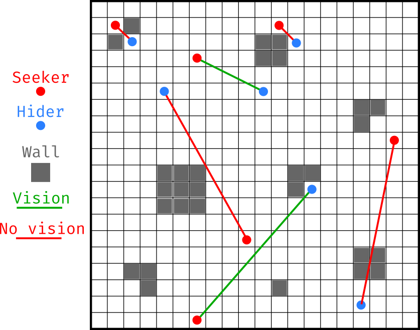

# Competitive Hide and Seek

- Theme: Puzzle/Algorithm
- Difficulty: Medium
- Time Estimate: 1-2 weeks
- Language: Python

Feel free to read the submission on [github](https://github.com/dudarboh/Competitive-Hide-and-Seek#) with pictures and code.

## Concept

You and your friend are playing hide & seek.
You both randomly spawn in a 2D grid-like room. The room has randomized walls that obstruct vision.
If you are a seeker, your goal is to write an algorithm to catch the hider with the fewest steps possible.
If you are a hider, your goal is to write an algorithm to delay the catching as much as possible.
You can choose whether you want to play as a seeker or a hider. You can submit for both sides if you like.

## Winners

All submitted algorithms for seekers and hiders will compete against each other on a predefined hidden test set of random maps and starting locations (set size to be determined).

The algorithm's performance is evaluated as an average across all games of the number of steps to catch the hider.

Therefore are two sets of gold/silver/bronze winners.
Three for the best seeker algorithm. Three for the best hider algorithm.

## Game Rules

### Map

The map is a 2D grid of 20x20 (always the same size) cells.
Each map has randomly placed walls of different shapes.
The walls always cover approximately 25% of the map and in such a way that there are no inaccessible cells.

### Movement

Both players are only allowed to move left, right, up, or down if there is no wall in front of the movement and they don't go out of bounds of the map.

The speed of the seeker is double the hider's to make catching possible.
I.e., the seeker moves every step/iteration, while the hider moves only every *second* step.

On the second step, the seeker has the priority, i.e., the hider two distances away is always being caught if the seeker moves towards the hider.

### Spawn Locations

The spawn of a seeker is uniformly random on the entire map.
The spawn of a hider is uniformly random on the furthest quadrant from the seeker spawn to make close-distant spawns less likely.

The spawn at a distance closer than three is forbidden, as it is an automatic win for the seeker.
The players spawn only in the "non-wall" (empty) cells.

### Vision

The players have a vision of each other if there are no walls crossing the line connecting the two players.
Once the players have vision of each other, they get the precise coordinates of their opponents.

### Beginning of the game

At the beginning of the game, both players are given the full knowledge of the map and the starting locations of both the seeker and the hider.

### End of the game

When the seeker's location becomes the hider's location, the game is over, and the number of the steps it took is the score for both algorithms.

To avoid games taking too long to finish, there are two other constraints:
1. The maximum number of steps is 10 x map_size = 4000. If the hider is not caught within 4000 steps, the hider is considered a winner with the highest score of 4000.
2. If the game lasts more than 5 minutes on the testing computer, the game is aborted, and the player who thought for the least time is considered a winner with the best possible score (1 for the seeker, 4000 for the hider).

## Rules and Considerations

### Programming Language

The main challenge is to solve the puzzle.
Thus, the specific programming language is not strictly required to solve it.
However, to make competitive integrity and testing of many solutions possible, the language of the submission and the game is chosen to be Python for the easiest syntax.

### AI usage

You are allowed to use AI tools as well as LLM-generated content any way you like.
However, if you use the AI directly for help with the solution, you are required to disclaim this and, if possible, explain which parts of the solution the AI is responsible for. Your solution will be marked with the *(AI)* to indicate AI usage in the table of records.

### Exploits

As the main challenge in solving the puzzle, the code is not intended to be exploitable.
Thus, hacks and exploits are not the primary goal of this challenge; however, they are not forbidden. If you manage to find an exploit, you are welcome to do so and write your submission. Your entry in the table of records will be marked with *(exploit)*, though, to indicate an out-of-the-box solution.

However, if you find a *very trivial* exploit/bug potentially exploitable by many people, it would be nice to fix it.

### Performance Requirements

There are no CPU or memory requirements.
But please, be reasonable within the standard computer capabilities.

As mentioned above, there is a mandatory time requirement of the game duration to be less than 5 minutes.
If the game exceeds 5 minutes of execution time, the algorithm contributing most to the execution time will be marked as the loser!

This is to avoid any algorithms that think infinitely about the next step.

Please make sure your algorithms are not stuck in the infinite loops and don't break games!

## How to submit?

You are expected to write your own modified version of the `Seeker` or `Hider` class.

The rest of the code should remain untouched. Your solution should be as easy as copy-pasting your class implementation into the existing code.

### Detailed Constraints of the Implementation

1. You cannot modify the imports. NumPy is the only external package that you have.

2. Your class must inherit the `Player` class and have the same start of the constructor as the player class.
3. You are not allowed to modify input arguments to the constructor. This is all information that is available to you.
4. Your class must implement `move()` method that is repeatedly called in the game loop. It should change the player's position.
5. Your `move()` method should move the play position only one cell at a time. No teleportation!
6. Your `move()` method should not climb walls.
7. Your `move()` method should escape the realm of the existing 20x20 world.

```python
def Seeker(Player):
    def __init__(self, game_map, spawn_position, enemy_spawn_position):
        super().__init__(game_map, spawn_position, enemy_spawn_position)

    def move(self):
        next_pos = self.very_advanced_catching_algorithm()

        if movement_rules_obided(self.game_map, self.pos, next_pos):
            self.pos = next_pos
```

If your `move()` method does not follow these rules, the game will keep you at the current location.

Please make sure your code runs on a decently modern Python 3 and NumPy version.
To be confirmed which specific versions are used for testing. 
E.g., the current code runs fine with `Python == 3.9.21` and `numpy == 2.0.2`.

## Code Details

- `main.py` - main game loop logic and checks for rules
- `map.py` - map generation
- `players.py` - file containing Seeker and Hider strategies
- `game_utils.py` - spawn/vision/movement functions used in the game

### Map Generation

The map is a 20x20 2D NumPy array. The values of 0 and 1 represent empty cells/walls, respectively.

You can check the `map.py` for details.

The `axis=0` is considered an x position, and `axis=1` is a y position.


```bash
python3 map.py 42
```

```
Map is generated with seed 42. Good connectivity? True. Wall fraction: 0.26.
[[0 0 0 0 0 0 0 0 0 0 0 0 0 0 0 0 0 0 0 0]
 [0 0 0 0 0 1 0 0 1 0 0 0 0 0 0 0 0 0 0 0]
 [0 0 0 0 0 1 1 0 1 1 0 0 0 0 0 0 0 0 0 1]
 [0 0 0 0 0 0 0 0 0 1 1 1 1 0 0 0 0 0 0 1]
 [0 0 0 0 0 0 0 0 0 0 1 1 1 0 0 0 0 0 0 0]
 [0 1 1 0 0 0 0 0 0 0 1 1 1 0 0 0 0 0 0 0]
 [0 0 1 0 0 0 0 0 1 1 0 0 0 0 1 0 0 0 1 1]
 [0 0 0 0 0 0 0 0 1 1 0 1 1 1 1 1 0 1 1 0]
 [0 0 0 0 0 0 1 0 0 0 0 1 1 1 0 0 0 1 1 0]
 [0 0 0 0 0 0 0 0 0 0 0 1 1 1 0 0 0 0 0 0]
 [0 0 0 0 0 0 0 0 0 0 0 0 0 0 1 1 0 0 0 0]
 [1 1 1 0 0 0 0 0 0 0 0 0 0 0 1 0 0 1 1 0]
 [1 1 1 0 0 0 0 0 0 0 0 0 0 0 1 0 0 1 1 0]
 [0 0 0 1 1 0 0 0 0 0 0 0 0 0 0 0 0 0 0 0]
 [0 0 0 1 1 0 0 1 1 1 0 0 0 0 0 1 1 1 1 0]
 [0 0 0 0 0 0 0 1 1 1 1 0 0 0 0 0 1 1 0 0]
 [0 0 0 0 0 0 0 1 1 1 1 1 1 1 0 0 0 0 1 1]
 [0 0 0 0 0 0 0 0 0 0 0 1 1 1 1 0 0 0 1 1]
 [0 0 0 0 0 0 1 1 1 0 0 1 1 1 1 0 0 0 1 1]
 [0 0 0 0 0 0 1 1 1 0 0 0 0 0 1 1 0 0 0 0]]
0 - empty
1 - wall
2 - seeker
3 - hider
```

### Vision

The vision is defined in `game_utils.py` in `see_each_other(game_map, seeker_pos, hider_pos)`.

The players have vision of each other and are given their corresponding coordinates if the line connecting them does not intersect the walls.
The "exactly at the corner of the wall" cases are treated as no vision.



### Example submission

The current code features example Seeker and Hider implementation.
You can check them out and even run the game to get the feeling how everything works.

```python
python3 main.py 42 42
```